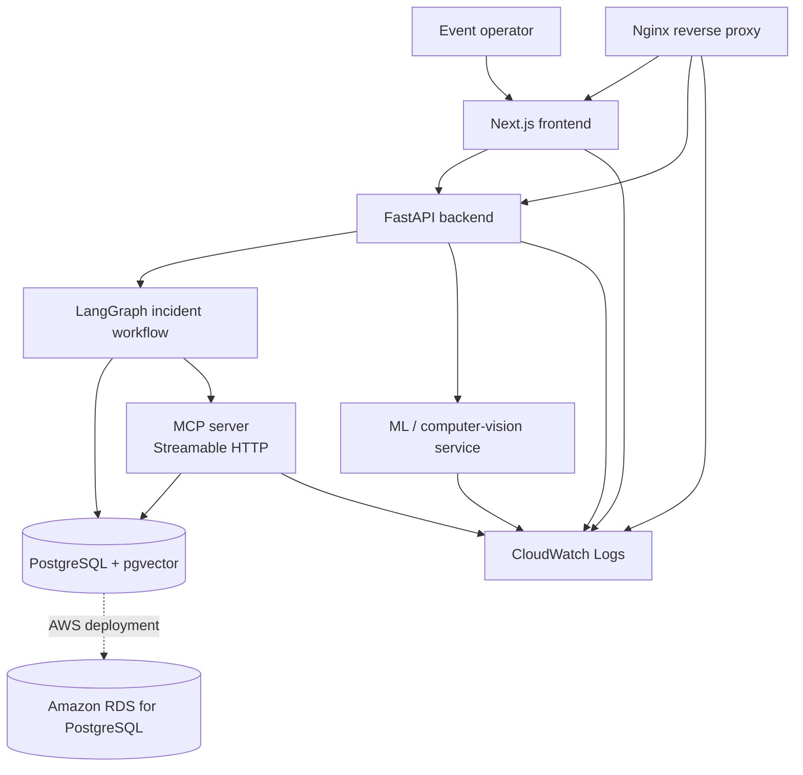

# NexCord

**A voice-first, human-in-the-loop incident commander for live events.**

NexCord helps event teams respond to operational problems such as equipment failures, room conflicts, unavailable staff, and overcrowding. It gathers operational context, proposes and simulates responses, waits for an operator's approval, executes approved actions through tools, and verifies the resulting state.

> **Project status:** The multi-service Docker Compose application has been deployed to AWS and the approval-to-execution-to-verification workflow has been exercised end to end. CloudWatch logging and observability resources are configured. NexCord is a project/demo deployment, not a production-ready service.

**Repository:** [github.com/msaimanish/NexCord](https://github.com/msaimanish/NexCord)

## Contents

- [Why NexCord?](#why-nexcord)
- [Core workflow](#core-workflow)
- [Architecture](#architecture)
- [Technology stack](#technology-stack)
- [Verified demo scenario](#verified-demo-scenario)
- [AWS deployment and observability](#aws-deployment-and-observability)
- [Run locally](#run-locally)
- [Useful Docker commands](#useful-docker-commands)
- [Data and persistence](#data-and-persistence)
- [Security and limitations](#security-and-limitations)
- [Project scope](#project-scope)

## Why NexCord?

Live events rely on tightly connected resources: rooms, people, vendors, equipment, and schedules. A single incident can create multiple downstream problems. NexCord is designed to help an operator make a decision using operational context instead of letting an agent execute an unreviewed action.

Its guiding principle is:

**Observe → assess → propose → simulate → approve → execute → verify.**

Human approval is a required step in the intended operational workflow. A generated plan is not, by itself, authorization to perform an action.

## Core workflow

1. **Observe:** collect event and operational state.
2. **Detect and assess:** identify an incident and evaluate potential impact.
3. **Retrieve context:** use stored operational information and knowledge to ground the response.
4. **Generate candidate plans:** propose responses to the incident.
5. **Simulate:** evaluate candidates against resource availability and constraints.
6. **Select a plan:** rank successfully simulated plans using the application's current risk, delay, and cost criteria.
7. **Request approval:** wait for a human operator's decision.
8. **Execute through MCP:** send approved operations to the MCP server.
9. **Verify and recover:** check the resulting state and use recovery paths where supported.
10. **Audit:** retain plans, executions, and operational history for inspection.

## Architecture



The application is split into a frontend, API/agent backend, MCP tool server, ML service, and PostgreSQL database. Docker Compose runs the containers. For the AWS deployment, PostgreSQL is hosted separately on private Amazon RDS rather than as a Compose container, and Nginx routes browser traffic to the frontend and backend.

## Technology stack

| Area | Technology | Role |
|---|---|---|
| Frontend | Next.js, React, TypeScript | Operator interface for incidents, plans, simulation, and approval |
| API | Python, FastAPI, Uvicorn | REST API and application services |
| Agent workflow | LangGraph | Stateful incident-response orchestration and approval/resume flow |
| Database | PostgreSQL | Events, incidents, resources, plans, executions, and audit records |
| Vector search | pgvector | Store and retrieve knowledge embeddings |
| ORM and migrations | SQLAlchemy, Alembic | Database access and schema migrations |
| Tool integration | Model Context Protocol (MCP), Streamable HTTP | Route tool operations through a dedicated MCP server |
| Machine learning / CV | PyTorch, torchvision, Faster R-CNN ResNet-50 FPN v2 | Person detection and occupancy-related visual analysis |
| Local deployment | Docker, Docker Compose | Multi-service development environment |
| AWS deployment | EC2, Amazon RDS for PostgreSQL, Secrets Manager, Systems Manager Session Manager | Application hosting, managed database, secret storage, and instance access |
| Observability | CloudWatch Logs, metric filters, alarms; structured Nginx access logs | Centralized service logs, request-latency metrics, and error monitoring |

## Verified demo scenario

The demo scenario uses a **Robotics Final** event with a projector-failure incident. NexCord proposes allocating a backup projector and evaluates the resource change before requesting approval.

The AWS end-to-end demo was exercised through these steps:

1. The agent generated a plan to allocate a backup projector.
2. The operator reviewed and approved the plan in the UI.
3. The approved action executed through the application/MCP workflow.
4. The UI reported execution completion and successful verification.

This demonstrates the approval-to-execution flow against the demo database. It is not a claim that the service has been load-tested or validated for use at a live event.

## AWS deployment and observability

The AWS deployment uses the AWS-specific Compose configuration in `docker-compose.aws.yml`, AWS-specific CPU-only image definitions in `backend/Dockerfile.aws` and `ml/Dockerfile.aws`, and Nginx configuration in `deploy/nginx.conf`.

The configured AWS components include:

- **EC2:** hosts the Docker Compose application stack.
- **Amazon RDS for PostgreSQL:** private managed database with pgvector enabled.
- **AWS Secrets Manager:** stores database and LLM credentials used by the deployment.
- **AWS Systems Manager Session Manager:** supports instance administration without opening inbound SSH access.
- **Amazon CloudWatch Logs:** receives logs from the backend, MCP server, ML service, frontend, and Nginx. Log retention is configured for 14 days.
- **CloudWatch metrics and alarms:** metric filters and alarms are configured for service error events, API request latency, and HTTP 5xx responses.

Nginx emits structured JSON access logs, including URI, HTTP status, request time, and upstream response time. The API latency metric was verified with real requests; one five-request smoke-test sample had a mean request time of **4.4 ms** and a maximum of **5 ms**. This is a small verification sample, not a performance benchmark.

The error and HTTP 5xx alarms were in the `OK` state during the last check, but some had no datapoints because no matching events had been emitted. Their current state should not be interpreted as proof that every error path has been trigger-tested.

For deployment-specific procedures, use `docker-compose.aws.yml` and the deployment configuration in `deploy/`. Do not add live IP addresses, AWS account identifiers, database endpoints, secret values, or `.env` contents to public documentation.

## Run locally

### Prerequisites

- Git
- Docker Engine or Docker Desktop
- Docker Compose plugin
- The environment variables required by the local `docker-compose.yml`

### 1. Clone the repository

```bash
git clone https://github.com/msaimanish/NexCord.git
cd NexCord
```

### 2. Configure the environment

Copy the example environment file and edit it with values appropriate for your local environment:

```bash
cp .env.example .env
```

At minimum, provide the variables required by `docker-compose.yml` and the application configuration. The setup can include a local database password and an LLM API key, for example:

```dotenv
POSTGRES_PASSWORD=replace_with_a_strong_local_password
GEMINI_API_KEY=replace_with_your_key_if_needed
```

Use the exact variable names required by the current configuration. Never commit a real `.env` file, API key, database credential, or database backup.

### 3. Build and start the services

```bash
docker compose up --build -d
```

Check the containers:

```bash
docker compose ps
```

### 4. Verify the API

```bash
curl -i http://127.0.0.1:8000/health
```

A healthy API returns HTTP `200 OK` with a response similar to:

```json
{"status":"ok","service":"nexcord-api"}
```

Open the frontend at <http://127.0.0.1:3000>.

### Local service addresses

| Service | Local address | Notes |
|---|---|---|
| Frontend | <http://127.0.0.1:3000> | Operator UI |
| Backend API | <http://127.0.0.1:8000> | FastAPI service |
| Health check | <http://127.0.0.1:8000/health> | API health endpoint |
| MCP server | `127.0.0.1:8001` | Streamable HTTP endpoint is `/mcp`; a plain browser request may fail because MCP expects a protocol handshake |
| ML service | `127.0.0.1:8100` | Prediction/vision service; exposure depends on the local Compose configuration |
| PostgreSQL | `127.0.0.1:5432` | Local database, when published by the Compose configuration |

Published local development ports should remain bound to localhost. Do not expose the development database or internal service ports directly to the public internet.

## Useful Docker commands

```bash
# View running services
docker compose ps

# Follow logs from all services
docker compose logs -f

# Follow only backend logs
docker compose logs -f backend

# Rebuild and restart after configuration or code changes
docker compose up -d --build

# Stop services while retaining named volumes
docker compose down
```

> **Data-loss warning:** `docker compose down -v` removes Compose-managed volumes and can delete local PostgreSQL data. Use it only when intentionally resetting the database and after verifying that any needed data is backed up.

## Data and persistence

The PostgreSQL schema covers the event-operations domain, including:

- Events, venues, rooms, people, teams, vendors, and equipment
- Reservations and event-to-resource assignments
- Incidents, plans, plan actions, executions, and notifications
- Audit logs and operational observations
- Knowledge documents and chunks used by retrieval workflows
- LangGraph checkpoint tables for persistent agent state

The local database uses a named Docker volume, so ordinary container recreation should not delete its data. Before migrations, major changes, or moving databases, create and verify a backup. Treat backups as sensitive and keep them out of the public repository.

## Security and limitations

NexCord includes a human approval step, but it should not be considered production-secure solely because approval is present.

- Keep `.env`, API keys, database credentials, and SQL backups out of version control.
- The deployed RDS database is private and is intended to accept connections only from the application security group.
- Use AWS Secrets Manager for deployment secrets; do not put secret values in source control or public issue reports.
- The current demo ingress uses HTTP and IP-restricted access. It does not provide a production HTTPS/authentication setup; do not expose it as a public production service.
- Person detection was tested with a sample image. Live camera/video integration is not currently demonstrated by that test.
- ML predictions and agent-generated plans are decision support; they are not a substitute for operational judgment.
- Error alarms with no matching log events can have no datapoints. Validate alarm behavior deliberately before relying on it for production incident response.

